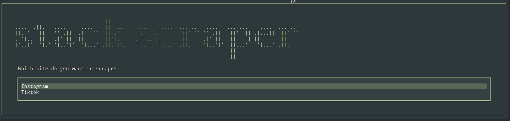
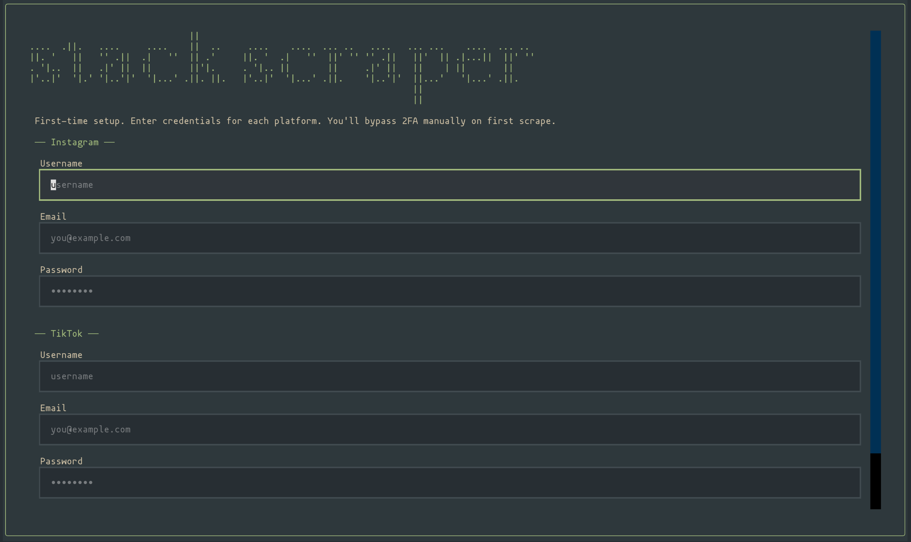

# Stack Scraper


Download and transcribe your saved Instagram and TikTok collections.

Stack Scraper logs into your account, opens your saved collections, grabs every post in them, and (optionally) downloads the videos, extracts audio, or generates text transcripts. Everything lives in the `./out` directory on your computer. No cloud, no accounts to sign up for, your data stays with you.

---

- **Download videos** — save every video from a saved collection as a `.mp4`
- **Download audio** — same thing, but just the audio as `.mp3`
- **Transcribe** — turn every video's audio into a text file, with the title, author, link, and duration at the top of each transcript

---

## Before you start

You'll need three things installed on your computer:

1. **Python 3.14 or newer** — https://www.python.org/downloads/
2. **Git** — https://git-scm.com/downloads (to clone this repo)
3. **uv** (a Python package manager) — run this in a terminal:
   - macOS / Linux: `curl -LsSf https://astral.sh/uv/install.sh | sh`
   - Windows: `powershell -c "irm https://astral.sh/uv/install.ps1 | iex"`

If you're on Windows, you'll also want to install **Chocolatey** from https://chocolatey.org/install — the setup script uses it.

If you want transcription features, Stack-Scraper currently uses voxtype, which only offers Linux+MacOS support.However, audio files are able to be scraped and downloaded so you can use any audio transcription application orservice of your choice, it just won't be automated here. Sorry!

---

## Installation

Open a terminal and run these one at a time:

```bash
git clone <this-repo-url>
cd stack-scraper
uv sync
bash install-deps.sh
```

That last line installs ffmpeg and yt-dlp. On Windows, run it from an **administrator** terminal.

---

## First-time setup

You need to tell Stack Scraper your Instagram and/or TikTok login so it can see your saved collections. Your credentials stay on your machine — they're only used to log in once, after which a browser session is saved locally.



Just run python stack-scrape.py, and the setup wizard will help you through setting up your credentials. If you'd prefer to do it manually, see steps:

1. Open `settings.toml` and make sure it exists.
2. Edit `usrdata/credentials.toml` with your logins:

```toml
[instagram]
username = "your_instagram_handle"
password = "your_instagram_password"

[tiktok]
username = "your_tiktok_handle"
password = "your_tiktok_password"
```

3. The first time you run Stack Scraper, a browser window will open and log you in. If you have **2FA** turned on, you'll need to approve the login on your phone — the script waits for you. After that, it remembers the session and won't ask again.

---

## Using it

### The easy way: the wizard

Just run:

```bash
uv run python stack-scrape.py
```

A menu opens in your terminal. Use the **arrow keys** and **Enter** to:

1. Pick a site (Instagram or TikTok)
2. Pick a saved collection
3. Pick what to do — download videos, download audio, or transcribe

A progress bar shows how far along it is. Press **Escape** to go back, **q** to quit.

### Where your files end up

Everything lands in the `out` folder next to the script:

```
out/
├── downloads/
│   ├── instagram/<collection-name>/videos/     ← video files
│   ├── instagram/<collection-name>/audio/      ← mp3 files
│   └── instagram/<collection-name>/audio/wavs/ ← wav files (used for transcription)
└── transcripts/
    └── instagram/<collection-name>/            ← text transcripts
```

Each transcript starts with a header like:

```
Title:    Some Video Title
Author:   someuser
URL:      https://www.tiktok.com/@someuser/video/123
Duration: 2:34
────────────────────────────────────────────────────────────
[transcript text here...]
```

### The command-line way (for power users)

If you'd rather skip the wizard:

```bash
# list collections you've already scraped
uv run python stack-scrape.py see-collections instagram

# full non-GUI flow, prompts you for collection + action
uv run python stack-scrape.py run-nogui instagram false
```

The second argument (`false`) is whether to run the browser in the background. Use `false` the first time so you can approve 2FA.

---

## FAQ

**It asked me for 2FA and then just sat there.**
That's normal. Go to your phone, approve the login, and Stack Scraper will continue on its own.

**My collection has photo posts mixed in with videos. What happens?**
Photo posts get filtered out automatically — only videos are downloaded. (yt-dlp doesn't support photo posts.)

**It says "voxtype not found".**
You don't have voxtype installed. Either install it, or just use "Download video" / "Download audio" instead of "Transcribe".

**I re-ran it and nothing happened.**
That's on purpose. If a file already exists, Stack Scraper skips it so you don't re-download. To force a fresh run, delete the relevant folder under `out/` and try again.

**The wizard looks broken / colors are wrong.**
Try a different terminal.

**Something crashed and I can't tell why.**
Try running the CLI version (`run-nogui`) instead — it prints errors straight to the terminal instead of inside the wizard box.

---
